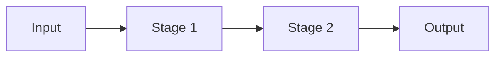

# Research Paper Deep-Dive — Reference

Templates, conventions, and checklists. Load this alongside `SKILL.md` when running the workflow.

---

## Slug generation

From the paper title, build a slug:

- Lowercase, hyphen-separated
- Strip stopwords ("a", "the", "of", "for", "and", "in", "on", "to") **unless** dropping them destroys meaning
- Strip subtitles after the colon if the main title is already distinctive
- Cap at ~6 words
- Add author prefix only if the title is generic (e.g., `chollet-on-the-measure-of-intelligence`)

Examples:
- "Attention Is All You Need" → `attention-is-all-you-need`
- "BERT: Pre-training of Deep Bidirectional Transformers for Language Understanding" → `bert-pretraining`
- "On the Measure of Intelligence" → `on-the-measure-of-intelligence`
- "A Simple Framework for Contrastive Learning of Visual Representations" (SimCLR) → `simclr`

Show the slug to the user before creating the directory and offer rename.

---

## Calibration

Ask before Phase 1 (skip questions whose answers are already obvious from context):

| Question | Why it matters |
|---|---|
| **Familiarity** — new / comfortable / expert in the subfield? | Sets the floor for what gets defined. Don't re-explain "attention" to an NLP researcher. |
| **Goal** — understanding / implementing / reviewing / building on? | Weights phases. Implementers need Phase 4 + 7. Reviewers need Phase 6. |
| **Depth** — full mechanics or conceptual only? | Decides whether Phase 4 is written at all, and at what register. |
| **Time budget** — one sitting or across sessions? | Affects pacing and how much to write per phase. |

Record answers verbatim in `README.md` under `## Calibration`.

---

## `README.md` template

```markdown
# <Paper Title> (<First Author> et al., <Year>)

**Source**: `paper.pdf` (saved <YYYY-MM-DD> from <original URL or "local upload">)
**Venue / status**: <NeurIPS 2017 / arXiv preprint / ICLR 2024 / ...>
**Authors**: <comma-separated list>

## Calibration
- **Familiarity**: <user's answer>
- **Goal**: <user's answer>
- **Depth**: <user's answer>
- **Time budget**: <user's answer>

## Paper
- [paper.pdf](paper.pdf)

## Notes
- [01 — Pitch](01-pitch.md)
- [02 — Contribution & positioning](02-contribution.md)
- [03 — Method overview](03-method-overview.md)
- [04 — Method mechanics](04-method-mechanics.md)
  - [Component: <name>](04-components/<slug>.md)
- [05 — Experiments](05-experiments.md)
- [06 — Critique](06-critique.md)
- [07 — Connections & practical use](07-connections.md)
- [Glossary](glossary.md)
- [Q&A log](questions.md)

## Background primers
*(Prerequisite concepts the paper assumes — added only when needed for the user's calibration level.)*
- [<concept>](background/<concept-slug>.md)

## Status
- Phases done: <list>
- Phases pending: <list>
- Last updated: <date>
```

Keep `## Status` and the Notes / Background sections in sync as files are written. Every new component, background primer, or topic file the skill creates must be linked from `README.md`.

---

## Phase templates

Every phase file opens with one line restating the phase's goal, then the content. Use `## ` headings liberally so chat messages can point at specific sections.

### Phase 1 — `01-pitch.md`

**Goal**: The 30-second elevator. If the user reads only this, what should stick?

```markdown
# Pitch

> One-paragraph elevator pitch.

## The problem
- One sentence on the problem and why it matters

## What's broken with the current state of the art
- One sentence

## The core idea
- One sentence on the paper's trick

## Headline result
- One sentence on what they showed
```

No equations, no jargon the user hasn't met. Total: one short paragraph or 4 bullets.

### Phase 2 — `02-contribution.md`

**Goal**: Separate what's actually new from standard practice.

```markdown
# Contribution & positioning

## Named contributions
- **C1 — <label>**: <one-line description>. *Type*: [method | finding | dataset | framing].
- **C2 — ...**
- (2–5 bullets)

## Lineage
- Builds on: <paper or method> — what it took from there
- Extends / replaces: <paper> — what it changes
- Contradicts: <paper> — where it disagrees

## The "delta"
- What changes about the field if this paper is right? (1–2 sentences)
```

### Phase 3 — `03-method-overview.md`

**Goal**: A whiteboard-able block diagram. No precise formalism.

````markdown
# Method overview

## Pipeline at a glance



## Stages

### Stage 1 — <name>
- **Input**: ...
- **Output**: ...
- **Purpose**: why this stage exists

### Stage 2 — <name>
- ...

## Key design choices
- <choice> — what they did, what they rejected, and why
- ...

## Worked-through trace in plain English
- "Take an input X. The embedding layer turns it into a sequence of vectors. Attention mixes them according to..."
````

### Phase 4 — `04-method-mechanics.md` (or `04-components/<slug>.md` per component)

**Goal**: Precise details. Math, pseudocode, architecture — whichever the paper actually uses.

**Per component, use this internal template**:

````markdown
# <Component name>

## Purpose
- One line on what role this component plays.

## Inputs and outputs
- **Inputs** with shapes / types:
  - $X \in \mathbb{R}^{B \times T \times d}$ — sequence of $T$ tokens, embedding dim $d$
- **Outputs** with shapes / types:
  - $Y \in \mathbb{R}^{B \times T \times d_{out}}$

## Parameters
- $W_Q \in \mathbb{R}^{d \times d_k}$ — query projection
- ...

## Mechanics
For each operation: equation, shape annotation, one-line intuition.

- **Step 1 — project to queries**:
  $$Q = X W_Q, \quad Q \in \mathbb{R}^{B \times T \times d_k}$$
  *Intuition*: turns each token into a "question vector" used to look up keys.
- **Step 2 — ...**

Or, for algorithmic / systems papers:

```text
function <Name>(input):
    ...
    return output
```
with a complexity note: "$O(n^2)$ in sequence length, $O(n)$ memory for the buffered variant."

## Worked example
Plug in concrete numbers: $B = 2$, $T = 128$, $d = 512$, $d_k = 64$.
Trace shapes through every step:
- $X$: `(2, 128, 512)`
- $Q$: `(2, 128, 64)`
- ...

## Caveats and variants
- Common pitfalls (e.g., "without the $\sqrt{d_k}$ scaling, the softmax saturates")
- Alternative formulations in the literature
- What this paper does differently from the standard
````

### Phase 5 — `05-experiments.md`

**Goal**: What was tested, and what the numbers actually say.

```markdown
# Experiments

## Benchmarks
| Benchmark | Measures | Known issues |
|---|---|---|
| MMLU | Knowledge across 57 subjects | Train-test contamination is a known issue |
| ... | ... | ... |

## Baselines
- <baseline> — was it the obvious comparison? Tuned with comparable effort?

## Headline numbers (in context)
- "<+X.Y points on benchmark Z>" — relative to baseline at <baseline number>; effect size = ...
- Note: single seed vs error bars vs multiple seeds — what did they actually report?

## Ablations
- Which design choices were isolated?
- Which conspicuously missing?

## Compute, data, and disclosure
- Compute disclosed? (GPUs, hours, FLOPs)
- Hyperparameters disclosed?
- Code released? Data released? (Link if yes.)

## Statistical practice
- Seeds, error bars, significance tests
```

### Phase 6 — `06-critique.md`

**Goal**: What a skeptical reviewer would say. Always evidence-first.

```markdown
# Critique

## From the paper alone

### Claims vs evidence
- Claim "<verbatim from abstract / intro>" — evidence is in §X, Table Y. Strength: <strong | weak | within noise>.

### Baselines and ablations
- <missing baseline> — would have been the obvious comparison
- <missing ablation> — design choice X is not isolated

### Disclosure gaps
- Hyperparameters: <disclosed | partial | absent>
- Compute: <disclosed | absent>
- Code/data: <released | promised | absent>

### Hand-waving
- §X: derivation skips from <step> to <step> without justification

### Reproducibility risk
- <factor> — <severity>

### Alternative explanations for headline gains
- ...

## From external sources
*(Populated when the user invokes deep critique mode. The invocation itself is the permission; announce the searches in chat before running them.)*

### Replication attempts
- <source URL> — <what they reported>

### Reviews and discussions
- <OpenReview link> — reviewer concerns
- <blog post / thread> — caveat: assess source quality

### Follow-up papers that challenge claims
- <paper>: <what it claims about this paper>

### Author / institution track record
- (Only when materially relevant. Avoid ad hominem.)
```

### Phase 7 — `07-connections.md`

**Goal**: How this paper fits the ecosystem, and what using it would actually look like.

````markdown
# Connections & practical use

## Direct ancestors
- <paper> — what was carried forward

## Direct descendants / follow-ups
- <paper> — what it extended or changed

## Adjacent / competing approaches
- <approach> — how it compares (axes: cost, accuracy, simplicity, generality)

## Implementation sketch
- Library / framework: ...
- Hardware: ...
- Rough lines of code, with gotchas
- Code snippet (if useful):

  ```python
  # minimal example
  ```

## Estimated cost to reproduce or use
- Compute: ...
- Data: ...
- Engineering effort: ...

## What you'd build on top
- Promising extensions
````

---

## `glossary.md` template

```markdown
# Glossary

## Symbols
| Symbol | Meaning | Shape / type | First appears |
|---|---|---|---|
| $d_k$ | key dimension | scalar | §3.2 |
| $Q$ | query matrix | $\mathbb{R}^{B \times T \times d_k}$ | §3.2 |

## Terms
### <term>
One-paragraph definition. Why it matters in this paper.
```

Add an entry whenever a new symbol or term is introduced. Link from the first-use site in the phase file.

---

## `questions.md` template

```markdown
# Q&A log

Captures ad-hoc questions and answers that don't fit cleanly into a phase file.

## YYYY-MM-DD — <short question summary>

**Q**: <user's question, paraphrased>

**A**: <answer, with citations to the paper or external sources>
```

---

## Math notation conventions

- Use LaTeX inside `$...$` and `$$...$$` (GitHub renders both).
- Use `\mathbb{R}^{B \times T \times d}` for tensor shapes.
- Standard letters: `B` batch, `T` sequence/time, `H` heads, `L` layers, `d` hidden dim, `d_k` key dim, `d_v` value dim, `V` vocabulary size, `N` dataset size.
- Match the paper's notation when it has one; normalize sloppy notation and say you did.
- For element-wise operations, name them ("row-wise softmax", "element-wise sigmoid") rather than relying on symbols alone.

---

## Critique checklist (run through Phase 6)

Mention only the items that apply. Cite specific sections/figures/tables.

- [ ] Are claims well-supported by the experiments?
- [ ] Are the baselines fair, modern, and tuned with comparable effort?
- [ ] Are headline gains within noise / single-seed?
- [ ] Are there conspicuously missing ablations or comparisons?
- [ ] Did the authors test on the benchmark their narrative actually targets?
- [ ] Hyperparameters fully disclosed?
- [ ] Compute disclosed (GPUs, hours, FLOPs)?
- [ ] Code and data released?
- [ ] Derivations that get hand-waved?
- [ ] Alternative explanations for observed gains?
- [ ] Does the method's scaling story hold (cost, latency, memory)?
- [ ] Could the headline result be a benchmark artifact (contamination, leakage)?
- [ ] Authorship / venue / funding context worth flagging?
- [ ] (External) Have others replicated, failed to replicate, or challenged the results?
- [ ] (External) Are there OpenReview reviewer concerns that didn't get addressed?

---

## Paper-type adaptations

The seven-phase structure is tuned for ML/empirical papers. For other types, adjust:

- **Theory papers** — Phase 4 becomes proof structure (assumptions → key lemmas → main theorem → corollaries). Phase 5 collapses or becomes "examples / instantiations". Phase 6 focuses on whether assumptions are realistic.
- **Systems papers** — Phase 3 emphasizes architecture and component interactions; Phase 4 leans on data structures, algorithms, complexity. Phase 5 is throughput/latency/scalability; Phase 6 examines workload assumptions.
- **Empirical / measurement papers** — Phase 3 covers methodology; Phase 4 may be light; Phase 5 is the heart of the paper; Phase 6 is dominant — confounders, sampling bias, external validity.
- **Survey papers** — Skip Phase 4. Phase 3 becomes the taxonomy. Phase 6 critiques the taxonomy's framing and coverage gaps.
- **Position / opinion papers** — Phase 1 and 6 dominate. Phase 4 may be skipped entirely.

When in doubt about the paper type, say so in `README.md` under a `## Paper type` heading and use the closest match.

---

## Resuming prior sessions — checklist

Before doing anything else, when the user references a paper:

1. Check whether `<slug>/` already exists in the working directory.
2. If yes:
   - Read `<slug>/README.md` to recover calibration and phase status.
   - Glance at each existing phase file to know what's been covered.
   - In chat, summarize what's in place and offer: continue / drill into / redo.
3. If no, proceed with fresh ingestion.

Never overwrite without explicit confirmation. If the user explicitly says "start over", archive the existing directory to `<slug>.archive-<YYYY-MM-DD>/` rather than deleting.

---

## Chat-reply skeleton (copy-paste)

Every substantive chat reply after writing/updating a file should look roughly like:

> **Wrote** `<slug>/<file>.md` (or **Updated** `<slug>/<file>.md` — `## <section>`).
> **Look at**: `## <section heading>` (or "the table at the top", "the worked example", etc.).
> **Next**: continue to `<next>.md`, drill into `<component>`, or ask a follow-up.

Three short lines. Anything longer belongs in the file.

---

## Failure modes to avoid

- Long explanations in chat instead of in a file.
- Overwriting existing notes silently.
- Skipping the worked example in Phase 4 components.
- Vague critique ("scalability concerns") instead of specific, cited critique.
- Pulling external sources silently (always announce in one line what you're searching for and why, then run; cite URLs in the file).
- Restating the paper's marketing language without translation.
- Letting math drift away from intuition — every equation paired with "what this is doing".
- Forgetting to keep `README.md`'s `## Status` section in sync as phases are written.
